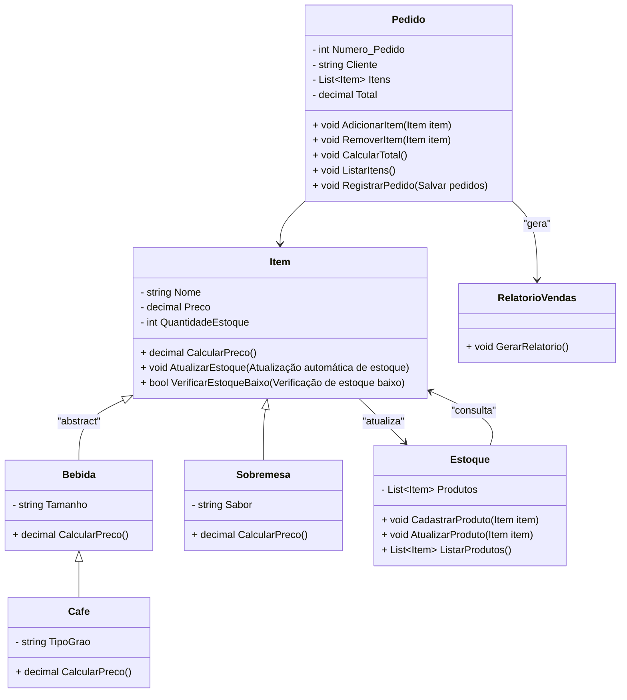

```mermaid
classDiagram
    class Pedido {
        - int Numero_Pedido
        - string Cliente
        - List~Item~ Itens
        - decimal Total
        + void AdicionarItem(Item item)
        + void RemoverItem(Item item)
        + void CalcularTotal()
        + void ListarItens()
        + void RegistrarPedido(Salvar pedidos)
    }

    class Item {
        - string Nome
        - decimal Preco
        - int QuantidadeEstoque
        + decimal CalcularPreco()
        + void AtualizarEstoque(Atualização automática de estoque)
        + bool VerificarEstoqueBaixo(Verificação de estoque baixo)
    }

    class Bebida {
        - string Tamanho
        + decimal CalcularPreco()
    }

    class Cafe {
        - string TipoGrao
        + decimal CalcularPreco()
    }

    class Sobremesa {
        - string Sabor
        + decimal CalcularPreco()
    }

    class RelatorioVendas {  
        + void GerarRelatorio()
    }

    class Estoque {
        - List~Item~ Produtos
        + void CadastrarProduto(Item item)
        + void AtualizarProduto(Item item)
        + List~Item~ ListarProdutos()
    }

    Pedido --> Item
    Pedido --> RelatorioVendas : "gera"
    Item <|-- Bebida : "abstract"
    Bebida <|-- Cafe
    Item <|-- Sobremesa
    Item --> Estoque : "atualiza"
    Estoque --> Item : "consulta"
```